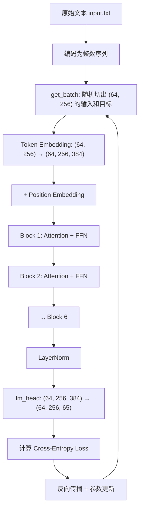

# BuildGPT-Code

Python Code for https://github.com/SongXP111/BuildGPT

从零开始构建一个 GPT 语言模型，使用 PyTorch 实现 Transformer 架构，在莎士比亚文本上训练。

## 项目结构

| 文件 | 描述 |
|------|------|
| `gpt.py` | 完整的 GPT 模型实现（约 10.8M 参数） |
| `bigram.py` | 简单的 Bigram 基线模型 |
| `input.txt` | 训练数据（莎士比亚全集） |

## 运行方式

```bash
# 激活虚拟环境
source .venv/bin/activate

# 运行 GPT 模型训练 + 生成
python3 gpt.py
```

## 超参数配置

| 参数 | 值 | 说明 |
|------|----|------|
| `batch_size` | 64 | 每批处理的序列数 |
| `block_size` | 256 | 最大上下文长度 |
| `n_embd` | 384 | 嵌入维度 |
| `n_head` | 6 | 注意力头数量 |
| `n_layer` | 6 | Transformer Block 层数 |
| `dropout` | 0.2 | Dropout 比率 |
| `learning_rate` | 3e-4 | 学习率 |
| `max_iters` | 5000 | 训练迭代次数 |

---

# gpt.py 深度逐类解析
---

## 0. 前置概念：什么是"张量 (Tensor)"？

在这份代码里你会频繁看到 `(B, T, C)` 这样的形状标注。

- **Tensor** 就是一个多维数组。一维的是列表 `[1,2,3]`，二维的是表格（矩阵），三维的就是"一叠表格"。
- **B** = Batch size（批次大小）：一次同时处理多少条句子，这里是 64。
- **T** = Time-step（序列长度）：每条句子有多少个字符，最大为 block_size = 256。
- **C** = Channels（通道/特征维度）：每个字符用多少个数字来表示，这里是 n_embd = 384。

所以 `(B, T, C)` = `(64, 256, 384)` 就像是：**64 本笔记本，每本有 256 页，每页上写了 384 个数字**。

---

## 1. 数据准备 (Lines 1–48)

### 1.1 编码与解码 (Lines 25–32)

```python
chars = sorted(list(set(text)))    # 找出文本中所有不重复的字符，比如 65 个
vocab_size = len(chars)            # 词汇表大小 = 65

stoi = { ch:i for i,ch in enumerate(chars) }  # 字符 -> 数字
itos = { i:ch for i,ch in enumerate(chars) }  # 数字 -> 字符

encode = lambda s: [stoi[c] for c in s]       # "hi" -> [46, 47]
decode = lambda l: ''.join([itos[i] for i in l])  # [46, 47] -> "hi"
```

**类比**：这就是一本"密码本"。计算机不认识字母，所以我们给每个字符分配一个编号。

### 1.2 `get_batch` 函数 (Lines 41–48)

```python
def get_batch(split):
    data = train_data if split == 'train' else val_data
    ix = torch.randint(len(data) - block_size, (batch_size,))  # 随机选 64 个起始位置
    x = torch.stack([data[i:i+block_size] for i in ix])         # 输入：每段 256 个字符
    y = torch.stack([data[i+1:i+block_size+1] for i in ix])     # 目标：每段向后错一位
    return x, y
```

**具体例子**：假设文本是 `"hello world"`，block_size=5：

| 输入 x | 目标 y | 含义 |
|--------|--------|------|
| `hello` | `ello ` | 看到 `h` 应该猜 `e`，看到 `he` 应该猜 `l`，以此类推 |

模型的学习任务就是：**给定前面的字，猜下一个字**。

### 1.3 `estimate_loss` 函数 (Lines 50–62)

这个函数用来"模拟考试"。它随机抽 200 次样本，计算平均错误率（Loss），但**不更新模型参数**（`@torch.no_grad()` 的作用）。

---

## 2. `Head` 类 — 单头自注意力 (Lines 64–115)

这是整个 GPT 最核心的零件。

### 2.1 类比理解

想象一个教室里有 256 个学生（= T 个 token），每个学生手里有一张纸条写着自己想说的话。

- 每个学生准备 **3 张卡片**：
  - **Query (Q)**："我在找什么样的信息？"
  - **Key (K)**："我拥有什么样的信息？"
  - **Value (V)**："我实际要分享的内容。"

- 每个学生拿自己的 Q 去跟**所有其他学生的 K** 对比，算出一个"匹配分数"。
- 匹配分数高的学生 → 我更关注你 → 你的 V 在我最终的信息里占比更大。

### 2.2 `__init__` — 准备三张卡片的"模板"

```python
self.key   = nn.Linear(n_embd, head_size, bias=False)  # 384 -> 64
self.query = nn.Linear(n_embd, head_size, bias=False)  # 384 -> 64
self.value = nn.Linear(n_embd, head_size, bias=False)  # 384 -> 64
```

`nn.Linear(384, 64)` 就是一个矩阵乘法。它内部有一个 384×64 的权重矩阵（初始是随机数），把 384 维的输入压缩到 64 维。这个权重矩阵会在训练中被逐步优化。

### 2.3 掩码矩阵 `tril`

```python
self.register_buffer('tril', torch.tril(torch.ones(block_size, block_size)))
```

假设 T=5，则 `tril` 长这样：

```
1 0 0 0 0    ← 第1个学生只能看自己
1 1 0 0 0    ← 第2个学生能看第1、2个
1 1 1 0 0    ← 第3个学生能看第1、2、3个
1 1 1 1 0
1 1 1 1 1    ← 第5个学生能看所有人
```

**为什么需要它？** 因为我们在训练模型"猜下一个字"，所以绝对不能让它偷看未来的答案。

### 2.4 `forward` — 完整的注意力计算流程

**第一步：生成 Q 和 K**

```python
q = self.query(x)  # (64, 256, 384) → (64, 256, 64)
k = self.key(x)    # (64, 256, 384) → (64, 256, 64)
```

**第二步：计算注意力分数**

```python
wei = q @ k.transpose(-2, -1) * C**-0.5
```

- `q @ k.transpose(-2,-1)`：每个学生的 Q 和所有学生的 K 做点积（向量相乘再求和），得到一个 `(256, 256)` 的分数矩阵。`wei[i][j]` 就是"第 i 个学生对第 j 个学生的关注程度"。
- `* C**-0.5`：除以 √C，防止分数太大。如果分数太大，下一步 softmax 会变成接近 one-hot（只关注一个人），学不好。

**第三步：遮蔽未来 + Softmax**

```python
wei = wei.masked_fill(self.tril[:T, :T] == 0, float('-inf'))
wei = F.softmax(wei, dim=-1)
```

- 把不该看到的位置设为 -∞。
- `softmax` 把每一行变成"概率分布"（所有值在 0~1 之间，且每行求和 = 1）。-∞ 的位置变成 0。

**第四步：加权聚合 Value**

```python
v = self.value(x)   # (64, 256, 64)
out = wei @ v        # (64, 256, 256) @ (64, 256, 64) → (64, 256, 64)
```

用注意力权重对 V 做加权平均。如果第 i 个学生对第 j 个学生的注意力是 0.7，那第 j 个学生的 V 就贡献了 70% 的信息。

---

## 3. `MultiHeadAttention` 类 — 多头注意力 (Lines 117–146)

### 3.1 类比

一个 `Head` 就像一个只能从一个角度理解文本的阅读者。比如只关注语法、或只关注情感。

`MultiHeadAttention` 组建了 **6 个这样的阅读者**（n_head=6），每人处理 64 维特征（384 ÷ 6 = 64），然后把 6 个人的理解拼接在一起。

### 3.2 具体数据流

```
输入:  x (64, 256, 384)
         ↓ 分发给 6 个 Head
Head_0 → (64, 256, 64)
Head_1 → (64, 256, 64)
...
Head_5 → (64, 256, 64)
         ↓ 拼接 (torch.cat, dim=-1)
拼接后:  (64, 256, 384)    ← 6 × 64 = 384，又回到原始维度
         ↓ 线性投影 (self.proj)
输出:    (64, 256, 384)
```

`self.proj` 是一个 384→384 的线性层，作用是让 6 个头的信息互相融合（纯拼接是互相独立的）。

---

## 4. `FeedForward` 类 — 前馈网络 (Lines 148–171)

### 4.1 类比

如果说 `MultiHeadAttention` 是"小组讨论"（token 之间交流信息），那 `FeedForward` 就是讨论结束后**每个学生自己回去消化笔记**。

### 4.2 数据流

```
输入:        (64, 256, 384)
  ↓ nn.Linear(384, 1536)    ← 放大 4 倍，给"思考"更大的空间
中间:        (64, 256, 1536)
  ↓ ReLU()                  ← 把负数变成 0（引入非线性）
  ↓ nn.Linear(1536, 384)    ← 压缩回原来的维度
输出:        (64, 256, 384)
```

**为什么先放大再缩小？** 放大到 4 倍相当于给模型更多的"草稿纸空间"去做中间计算。最终再压缩回来，保证跟下一层的输入维度一致。

**什么是 ReLU？** 就是一个简单的函数：`max(0, x)`。正数不变，负数变成 0。没有它的话，多层线性变换堆叠起来等价于一个线性变换，模型的能力会大打折扣。

---

## 5. `Block` 类 — Transformer 积木块 (Lines 173–202)

### 5.1 结构

一个 Block 就是两步：

```
输入 x
  ↓
  ├── LayerNorm → MultiHeadAttention → 结果加回 x （残差连接）
  ↓
  ├── LayerNorm → FeedForward → 结果加回 x （残差连接）
  ↓
输出 x
```

### 5.2 两个关键设计

**LayerNorm（层归一化）**：
- 把数据标准化为均值=0、方差=1 的分布。
- 类比：考试前把所有科目的分数统一到同一个评分标准，这样数学和语文的分数才有可比性。

**残差连接（`x + ...`）**：

```python
x = x + self.sa(self.ln1(x))   # 而不是 x = self.sa(self.ln1(x))
```

- 类比：学生复习后，"新知识"是在"旧知识"的基础上叠加的，而不是完全替换。
- 技术原因：如果堆叠了很多层（这里是 6 层），没有残差连接的话，信号在传递过程中会逐渐"衰减消失"（梯度消失问题）。有了 `x + ...`，梯度可以通过 `+` 直接传回前面的层。

---

## 6. `GPTLanguageModel` 类 — 完整模型 (Lines 204–299)

### 6.1 `__init__` — 组装大脑

```
词嵌入表 (vocab_size=65, n_embd=384)
    ↓ 给每个字符一个 384 维向量身份
位置嵌入表 (block_size=256, n_embd=384)
    ↓ 给每个位置 (0~255) 一个 384 维向量
Block × 6 层
    ↓ 6 层 Transformer 深度处理
LayerNorm
    ↓
lm_head (384 → 65)
    ↓ 将 384 维特征转化为对 65 个字符的"投票分数"
```

### 6.2 `_init_weights` — 权重初始化

```python
torch.nn.init.normal_(module.weight, mean=0.0, std=0.02)
```

模型里的所有"权重"（矩阵里的数字）初始都是随机的。这里设定它们为均值 0、标准差 0.02 的小随机数。如果初始值太大，模型一开始就会产生极端的输出，训练会很不稳定。

### 6.3 `forward` — 从输入到预测

用一个具体例子，假设输入是 `"hell"`（4 个字符）：

```
"hell" → encode → [46, 43, 50, 50]  (整数索引)
                        ↓
         token_embedding_table 查表
                        ↓
         每个数字变成 384 维向量  →  tok_emb: (1, 4, 384)
                        ↓
         position_embedding_table 查表
                        ↓
         位置 [0,1,2,3] 各变成 384 维  →  pos_emb: (4, 384)
                        ↓
         tok_emb + pos_emb  →  x: (1, 4, 384)
         （每个字符现在知道自己是什么字 + 自己在第几个位置）
                        ↓
         6 层 Block 深度处理  →  x: (1, 4, 384)
                        ↓
         LayerNorm  →  x: (1, 4, 384)
                        ↓
         lm_head (384→65)  →  logits: (1, 4, 65)
```

`logits` 的含义：对于每个位置，模型给出了对 65 个字符的"投票分数"。分数最高的那个字符，就是模型认为最可能出现的下一个字。

### 6.4 Loss 计算

```python
loss = F.cross_entropy(logits, targets)
```

**交叉熵损失**衡量"模型的预测概率分布"和"正确答案"之间的差距。

- 如果模型给正确答案打了很高的分 → loss 小 → 猜得好。
- 如果模型给正确答案打了很低的分 → loss 大 → 猜得差，需要多调整。

### 6.5 `generate` — 文本生成

```python
for _ in range(max_new_tokens):       # 循环 500 次，生成 500 个字符
    idx_cond = idx[:, -block_size:]    # 只取最后 256 个字符作为上下文
    logits, _ = self(idx_cond)         # 让模型预测
    logits = logits[:, -1, :]          # 只看最后一个位置的预测（= 下一个字的分数）
    probs = F.softmax(logits, dim=-1)  # 转换成概率
    idx_next = torch.multinomial(probs, num_samples=1)  # 按概率随机抽一个字符
    idx = torch.cat((idx, idx_next), dim=1)  # 拼接到序列末尾
```

**为什么用随机抽样而不是取最大值？** 如果每次都选概率最大的字符，生成的文本会非常重复和无聊。随机抽样能带来多样性（类似 ChatGPT 的 temperature 控制）。

---

## 7. 训练循环 (Lines 301–325)

```python
for iter in range(5000):               # 训练 5000 轮
    xb, yb = get_batch('train')        # 抽一批训练数据
    logits, loss = model(xb, yb)       # 前向传播：预测 + 算错误
    optimizer.zero_grad(set_to_none=True)  # 清空上一轮的梯度
    loss.backward()                    # 反向传播：计算每个参数对错误的贡献
    optimizer.step()                   # 更新参数：朝减少错误的方向微调
```

**类比**：
1. 老师出题（`get_batch`）
2. 学生答题并批改得分（`forward` → `loss`）
3. 擦掉上次的笔记（`zero_grad`）
4. 分析错题原因（`backward`）
5. 改正理解（`step`）

重复 5000 次，学生就逐渐从"瞎猜"变成"能写出像模像样的莎士比亚风格文本"。

---

## 8. 整体数据流总结



## 9. 模型规模速算

| 组件 | 参数量估算 |
|------|-----------|
| Token Embedding | 65 × 384 = 24,960 |
| Position Embedding | 256 × 384 = 98,304 |
| 每个 Head 的 Q/K/V | 3 × 384 × 64 = 73,728 |
| 每个 Block 的 MultiHeadAttention | 6 头 × 73,728 + proj(384×384) = 589,824 |
| 每个 Block 的 FeedForward | 384×1536 + 1536×384 = 1,179,648 |
| 6 个 Block 总计 | ≈ 6 × 1.77M ≈ **10.6M** |
| lm_head | 384 × 65 = 24,960 |
| **总计** | **约 10.8M 参数** |

这个模型大约有 **1080 万个可学习参数**。作为对比，ChatGPT-3 有 1750 亿个参数——是这个模型的一万六千多倍。

---

## 10. 常见问题解答 (FAQ)

### Q1: 为什么需要缩放点积（除以 √C）？不除会怎样？

**核心问题**：`wei = q @ k.transpose(-2,-1) * C**-0.5` 中的 `* C**-0.5` 有什么用？

**回答**：

假设 Q 和 K 的每个元素都是均值为 0、方差为 1 的随机数。当我们计算点积时（两个向量逐元素相乘再求和），结果的方差会等于向量的维度 C。C 越大，点积的值就越大。

举个例子（假设 C=64）：
- 不缩放时，点积结果可能是 `[50, -30, 2, 45, ...]`
- 缩放后（除以 √64 = 8），变成 `[6.25, -3.75, 0.25, 5.6, ...]`

然后我们对这些分数做 softmax：

```
softmax([50, -30, 2, 45]) ≈ [0.993, 0.000, 0.000, 0.007]  ← 几乎是 one-hot！
softmax([6.25, -3.75, 0.25, 5.6]) ≈ [0.47, 0.00, 0.01, 0.52]  ← 分布更均匀
```

**不缩放的后果**：softmax 会把几乎所有的权重集中在最大值上（接近 one-hot），这意味着每个 token 只关注一个其他 token，忽略了其余所有信息。而且 softmax 在极端值附近的**梯度几乎为零**，导致反向传播时参数几乎收不到更新信号，训练停滞。

---

### Q2: Softmax 函数的数学原理是什么？为什么输出是概率分布？

**核心问题**：softmax 是怎么把任意数字变成"概率"的？

**回答**：

Softmax 的公式是：

```
softmax(x_i) = e^(x_i) / Σ e^(x_j)
```

用 Python 来理解：

```python
import math

scores = [2.0, 1.0, 0.5]

# 第一步：对每个分数取 e 的幂（e ≈ 2.718）
exps = [math.exp(2.0), math.exp(1.0), math.exp(0.5)]
# exps = [7.389, 2.718, 1.649]

# 第二步：除以总和，变成比例
total = sum(exps)  # = 11.756
probs = [x / total for x in exps]
# probs = [0.629, 0.231, 0.140]
```

**为什么一定是概率分布？**
- `e^x` 永远大于 0 → 所以每个值都 ≥ 0 ✅
- 最后除以总和 → 所以所有值加起来 = 1 ✅
- 原始分数越大 → `e^x` 越大 → 占的比例越高 → 概率越大 ✅

这就是为什么 softmax 天然是概率分布：它保证了非负性和归一性。

---

### Q3: K、Q、V 的参数是怎么学习到各自不同角色的？

**核心问题**：K、Q、V 都是 `nn.Linear`，PyTorch 怎么知道 K 该学"被搜索的特征"、Q 该学"搜索条件"、V 该学"实际内容"？

**回答**：

PyTorch **不知道**，也**不需要知道**。关键在于**它们在计算图中的位置不同**。

三个线性层的结构完全相同（都是 384→64 的矩阵乘法），初始时参数也都是随机的。但它们被用在了不同的数学运算中：

```python
wei = q @ k.transpose(-2, -1)   # Q 和 K 相乘 → 产生注意力分数
out = wei @ v                    # 注意力分数和 V 相乘 → 产生输出
```

当反向传播计算梯度时：
- **K 和 Q 的梯度**来自于 `wei = q @ k.T` 这个乘法。训练目标会推动 Q 和 K 的参数朝着"让正确的 token 对获得高注意力分数"的方向更新。
- **V 的梯度**来自于 `out = wei @ v` 这个乘法。训练目标会推动 V 的参数朝着"让输出包含有用信息"的方向更新。

类比：三个人一开始都是白纸，但因为被安排在了不同的岗位上（Q 负责提问、K 负责被匹配、V 负责提供内容），经过反复训练后，他们自然就各自学会了自己岗位需要的技能。**是"位置"决定了"职责"，而非预先编程。**

---

### Q4: 残差连接会影响训练速度吗？

**核心问题**：`x = x + self.sa(...)` 中直接把旧的 x 加回来，会不会让模型"改变太慢"？

**回答**：

恰恰相反，残差连接**加速**了训练。

**没有残差连接时**（假设 6 层网络）：
```
x → Block1 → Block2 → Block3 → Block4 → Block5 → Block6 → output
```
梯度需要从 output 一路乘回 Block1。每经过一层，梯度要乘以该层的导数（通常 < 1），经过 6 层后梯度变得极小，前面的层几乎学不到东西（**梯度消失**）。

**有残差连接时**：
```
x → Block1 → (+x) → Block2 → (+x) → ... → output
```
因为有 `+` 操作，梯度可以通过加法"直通"回到前面的层（加法的梯度恒为 1）。这就像给梯度开了一条"高速公路"，无论网络多深，前面的层都能收到有效的学习信号。

所以残差连接不仅不会变慢，反而是深层网络能够训练成功的关键。没有它，6 层网络可能根本训练不起来。

---

### Q5: 为什么多头注意力中每个头能学到不同的关注模式？

**核心问题**：6 个 Head 的结构完全一样，为什么训练后会关注不同的东西？

**回答**：

原因有两个：

**1. 随机初始化不同**

每个 Head 都有自己独立的 Q、K、V 权重矩阵，虽然结构一样，但初始的随机值不同。这导致训练一开始，每个头就从不同的"起点"出发，最终收敛到不同的模式。

类比：6 个学生拿到同一本书，但每人随机翻开不同的页开始读，最后每个人对书的理解角度自然不同。

**2. 梯度更新路径不同**

训练时，最终的 loss 对每个头的梯度是不同的（因为初始值不同 → 前向传播的中间结果不同 → 反向传播的梯度也不同）。随着训练进行，这种差异会被放大，最终每个头"特化"到不同的功能上。

在实际训练好的模型中，研究者发现不同的头确实会学到不同的模式，比如：
- 某个头专门关注"紧邻的前一个词"
- 某个头专门关注"句子开头的词"
- 某个头专门关注"语法上相关的词"

---

### Q6: FeedForward 层中的"思考/计算"具体是什么操作？

**核心问题**：FeedForward 被比喻为"消化和思考"，但它实际做的数学操作是什么？

**回答**：

FeedForward 做的事情可以用纯 Python 来理解：

```python
# 假设输入特征是一个 384 维的向量 x（代表一个 token 在经过注意力层后的特征）

# 第一步：线性变换 + 放大（384 → 1536）
hidden = W1 @ x + b1    # W1 是一个 1536×384 的矩阵

# 第二步：ReLU 激活（把负数变成 0）
hidden = max(0, hidden)  # 逐元素操作

# 第三步：线性变换 + 缩小（1536 → 384）
output = W2 @ hidden + b2  # W2 是一个 384×1536 的矩阵
```

**"思考"的本质是什么？**

- **第一步（放大）** 相当于把信息投射到一个更高维的空间（1536 维），在那里有更多的"轴"可以进行区分和组合。
- **第二步（ReLU）** 是关键：它选择性地"激活"某些维度（保留正值），"沉默"另一些维度（负值变 0）。这相当于一种**特征筛选**——"哪些组合是有意义的，保留；哪些是噪声，去掉"。
- **第三步（缩小）** 把筛选后的信息重新组合压缩回原始维度。

如果没有 ReLU，两个线性变换叠加等价于一个线性变换（矩阵乘法的结合律），放大再缩小就没有意义了。正是 ReLU 的非线性，让模型能够学习"如果 A 和 B 同时出现就激活，否则不激活"这样的复杂逻辑。

---

### Q7: 为什么需要多次 LayerNorm，而不是只在最后做一次？

**核心问题**：代码里每个 Block 都有 2 个 LayerNorm，6 个 Block 就有 12 个，再加最后 1 个共 13 个。为什么需要这么多？

**回答**：

LayerNorm 的作用是把数据的分布重新"校准"为均值=0、方差=1。

**为什么每层都需要？** 因为每经过一层计算（注意力层或 FFN），数据的分布（均值和方差）都会发生变化。如果不做归一化：

```
假设初始数据范围：[-1, 1]
经过 Block 1 后：[-5, 8]        ← 分布偏移了
经过 Block 2 后：[-50, 120]     ← 越来越极端
经过 Block 3 后：[-2000, 5000]  ← 数值爆炸
```

这会导致两个严重问题：
1. **数值不稳定**：极大或极小的值会导致浮点数溢出或精度丢失。
2. **训练困难**：后续层收到的输入分布不断变化（称为 **Internal Covariate Shift**），就像一个学生每次上课教室的灯光亮度都不一样，很难集中注意力。

**每层都做 LayerNorm 的效果**：

```
初始数据：[-1, 1]
→ Block 1 → LayerNorm → [-1, 1]  ← 重新校准
→ Block 2 → LayerNorm → [-1, 1]  ← 稳定
→ Block 3 → LayerNorm → [-1, 1]  ← 每层都能在稳定的范围内工作
```

每层的输入分布保持稳定，训练自然更高效。

---

### Q8: Dropout 是如何防止过拟合的？

**核心问题**：随机丢弃一些神经元连接，为什么反而能提高模型的泛化能力？

**回答**：

Dropout 在训练时，**每次前向传播随机将 20%（dropout=0.2）的神经元输出置为 0**。

```python
# 假设某层输出是 [0.5, 0.3, 0.8, 0.2, 0.9]
# 训练时 Dropout 可能把它变成：
#                     [0.5, 0.0, 0.8, 0.0, 0.9]  ← 第2和第4个被随机关掉了
```

**为什么这能防止过拟合？**

1. **防止"抱团依赖"**：如果没有 Dropout，某些神经元可能会形成固定的协作模式，比如"神经元 A 只要和神经元 B 一起出现就能猜对答案"。Dropout 随机关掉一些神经元，迫使每个神经元独立地学习有用的特征，而不是依赖特定的搭档。

2. **类比"团队考试"**：假设一个 5 人团队总是一起做作业，其中 2 人特别强，其他 3 人就"搭便车"不真正学习。Dropout 就像每次考试随机抽掉 1-2 个组员，这样每个人都必须自己掌握知识，而不能依赖别人。

3. **隐式集成效果**：每次 Dropout 产生的网络结构都不同，相当于训练了指数级数量的"子网络"。最终推理时关闭 Dropout，使用完整网络，相当于让所有这些子网络"投票"得出结果，这种集成效果提高了泛化能力。

**注意**：Dropout 只在训练时生效。推理/生成时（`model.eval()`），Dropout 会自动关闭，使用完整的网络。

---

### Q9: 6 个 Block 是并行的还是串行的？模型一共有多少个 Head？

**核心问题**：Block 之间的数据流是怎样的？

**回答**：

6 个 Block 是**串行（Sequential）**的，数据依次通过每一层：

```
输入 x → Block 1 → Block 2 → Block 3 → Block 4 → Block 5 → Block 6 → 输出
```

代码中使用的 `nn.Sequential` 就决定了这一点——前一层的输出是下一层的输入。

但在每个 Block **内部**，6 个注意力头（Head）是**并行**的，各自独立处理同一份输入，最后拼接结果。

所以模型一共有 **6 × 6 = 36 个 Head**，每个 Head 都有独立的 Q、K、V 参数：

```
Block 1:  [Head_1,  Head_2,  Head_3,  Head_4,  Head_5,  Head_6 ]  ← 并行
    ↓ 串行
Block 2:  [Head_7,  Head_8,  Head_9,  Head_10, Head_11, Head_12]
    ↓
Block 3:  [Head_13 ... Head_18]
    ↓
Block 4:  [Head_19 ... Head_24]
    ↓
Block 5:  [Head_25 ... Head_30]
    ↓
Block 6:  [Head_31 ... Head_36]
```

浅层的 Head 倾向于学到简单的局部模式（如字母搭配），深层的 Head 会基于前面已经加工过的特征，学到更复杂的长距离语义依赖。
